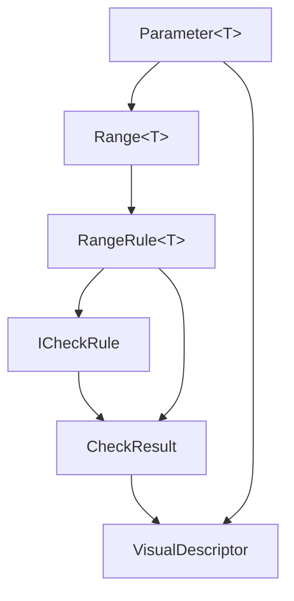
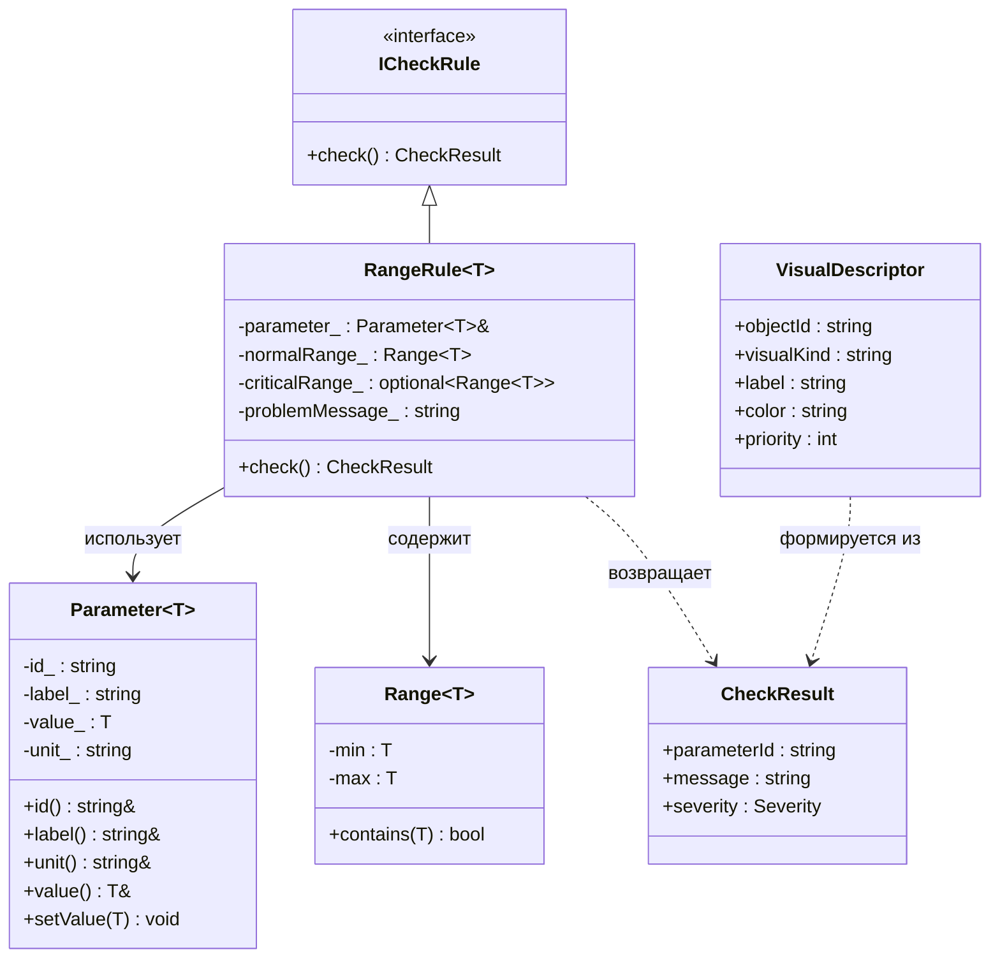

# dispatcher_trainer_lab1
Лабораторная работа 1: настройка рабочей конфигурации C++17/20.
## Среда
Основной вариант: VS Code + Docker Dev Container.
Альтернативный вариант: Linux в VirtualBox.
## Как открыть проект
1. Установить VS Code, Docker и расширение Dev Containers.
2. Открыть каталог проекта в VS Code.
3. Выполнить команду: Dev Containers: Reopen in Container.
## Сборка вручную
```bash
cmake -S . -B build/debug -G Ninja -DCMAKE_BUILD_TYPE=Debug
cmake --build build/debug
./build/debug/dispatcher_trainer_lab1
```
## Сборка в VS Code
1. CMake: Configure
2. CMake: Build
3. CMake: Run Without Debugging
4. Run and Debug → Debug CMake target with CodeLLDB
## Проверено
- [ ] контейнер открывается;
- [ ] CMake configure проходит без ошибок;
- [ ] проект собирается;
- [ ] программа запускается;
- [ ] breakpoint срабатывает;
- [ ] сделан первый commit.
# dispatcher_trainer — Лабораторная работа 2

Консольный прототип диспетчерского тренажёра транспортного узла.

## Вариант

**B — Диспетчер транспортного узла.**

Параметры состояния:
- Загруженность маршрута, %
- Связь с объектом (да/нет)
- Число активных нарушений

## Сборка и запуск

```bash
cmake -S . -B build -DCMAKE_BUILD_TYPE=Debug
cmake --build build
./build/dispatcher_trainer
## Будущая визуализация клиента
Вариант: диспетчер энергосети.
Планируемые элементы визуального ряда:
1. Карта объектов с маркерами подстанций.
2. Цветовой статус объекта: зелёный / жёлтый / красный.
3. Панель текущих параметров: нагрузка, связь, тревоги.4. AR-метка критического объекта над 3D-моделью.
5. AR-подсказка рекомендуемой команды диспетчера.
# Лабораторная работа 6 — Шаблоны и обобщённое программирование

## Вариант предметной области

**Транспортный диспетчер** — управление движением поездов на транспортном узле.

Параметры:
- Скорость поезда (`double`, км/ч)
- Интервал между поездами (`double`, мин)
- Задержка (`int`, мин)
- Занятость пути (`int`, %)
- Состояние светофора (`SignalState`, перечисление)

Визуальные слои: `platform_map`, `passenger_flow`, `gates`, `delays`, `ar_gate_marker`.

## Структура проекта

```
dispatcher-trainer/
├── CMakeLists.txt
├── README.md
├── .vscode/
│   ├── launch.json
│   └── settings.json
├── include/dispatcher/
│   ├── core/
│   │   ├── check_result.hpp        — Severity, CheckResult
│   │   ├── range.hpp               — concept OrderedValue, Range<T>
│   │   ├── parameter.hpp           — Parameter<T>
│   │   ├── rules.hpp               — ICheckRule, RangeRule<T>
│   │   ├── signal_state.hpp        — enum class SignalState
│   │   └── is_inside_range.hpp     — функциональный шаблон isInsideRange<T>
│   └── presentation/
│       └── visual_descriptor.hpp   — VisualDescriptor, makeDescriptor<T>, concept Streamable
├── src/main.cpp
└── tests/test_template_rules.cpp
```

## Команды сборки и запуска

```bash
# Создать ветку
git checkout -b lab6-templates

# Сборка
cmake -S . -B build -DCMAKE_BUILD_TYPE=Debug
cmake --build build

# Запуск приложения
./build/dispatcher_trainer

# Запуск тестов
ctest --test-dir build --output-on-failure
```

## Пример вывода

```
=== Проверка isInsideRange (функциональный шаблон) ===
isInsideRange(65.0, 0.0, 80.0) = 1
isInsideRange(3.5, 2.0, 10.0) = 1
isInsideRange(7, 0, 5) = 0

=== Проверка параметров через RangeRule<T> ===
V-101: OK [0]
I-201: OK [0]
D-301: Задержка недопустима [1]
O-401: OK [0]

=== Визуальные дескрипторы (DTO) ===
V-101 | gauge | Скорость поезда: 65 km/h | green | prio=0
I-201 | gauge | Интервал: 3.5 min | green | prio=0
D-301 | badge | Задержка: 7 min | yellow | prio=1
O-401 | badge | Занятость пути: 45 % | green | prio=0

=== Визуальные слои ===
- platform_map
- passenger_flow
- gates
- delays
- ar_gate_marker

=== Состояние светофора (enum class SignalState) ===
S-501 (Светофор): ON

Готово.
```

Тесты:
```
All tests passed!
```
## Mermaid-схема 1: поток данных



## Mermaid-схема 2: классы


