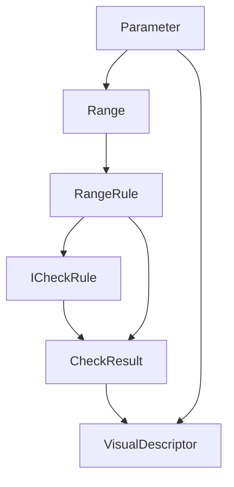
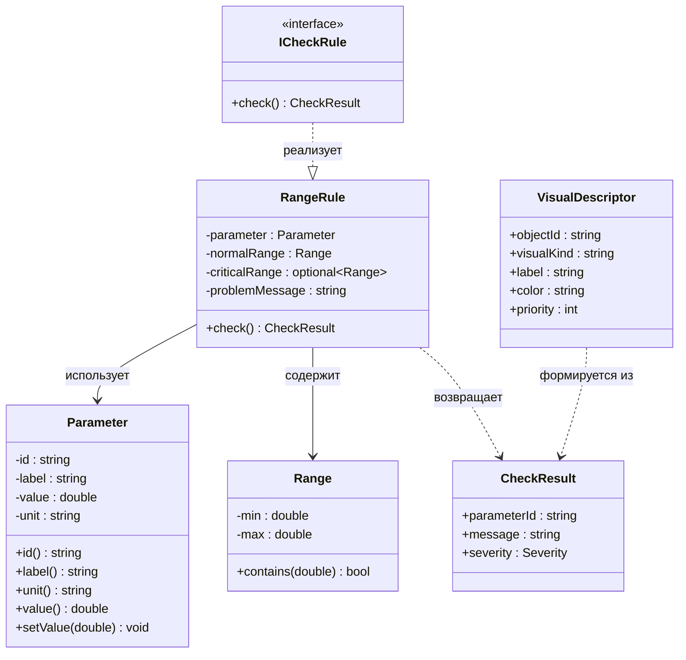
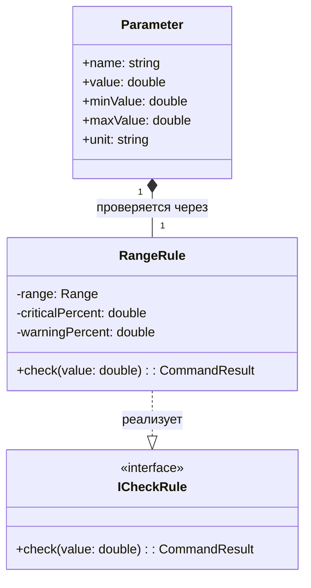

# dispatcher_trainer – Лабораторная работа 8: Modern C++ State

Цель работы: применить современные возможности C++ (C++17/20) для безопасной обработки состояний и команд в ядре диспетчерского тренажёра.

## Реализованные технологии

- **`std::optional`** — безопасный поиск параметров без «магических» значений вроде `-1`. Если параметр не найден, возвращается `std::nullopt`.
- **`std::variant`** — строгая типизация результатов команд: `CommandOk`, `CommandWarning`, `CommandError`. Вывод сообщения через `std::visit`.
- **`std::filesystem`** — сохранение журнала событий в файл `logs/dispatch_session.txt`.

---

## Проверяемые сценарии (пороговая логика)

| Сценарий | Значение | Ожидаемый результат | Логика порога |
|----------|----------|---------------------|---------------|
| Норма | 60.0 | Команда принята | В пределах [0..80] |
| Критическая зона (2%) | 79.0 | Критическая близость границы | 80 − (80 × 0.02) = 78.4 |
| Зона предупреждения (5%) | 77.0 | Предупреждение | 80 − (80 × 0.05) = 76.0 |
| Вне диапазона | 100.0 | Ошибка: значение вне диапазона | > 80 |

---

## Основные команды консольного меню

- `find <name>` — поиск параметра (использует `std::optional`).
- `set <param> <val>` — изменение параметра (результат в `std::variant`).
- `save` — сохранение журнала (через `std::filesystem`).
- `log` — просмотр журнала событий.

---

## Примеры работы (вывод в консоль)

**Поиск параметра:**

```text
find V-101
Найден: V-101 = 60 км/ч [0..80]

find NOPE
Параметр "NOPE" не найден.
```

**Изменение параметра:**

```text
set V-101 70.0
Команда принята: V-101 = 70

set V-101 90.0
Внимание: значение V-101 вне диапазона [0.000000..80.000000]
```

**Сохранение журнала:**

```text
save
Журнал сохранён: logs/dispatch_session.txt
```

---

## Сборка и запуск

```bash
cmake -S . -B build -DCMAKE_BUILD_TYPE=Debug
cmake --build build
./build/dispatcher_trainer
```

---

## Диаграмма 1: Поток данных



## Диаграмма 2: Классы правил и проверок



## Диаграмма 3: Ключевой фрагмент для ЛР 8

