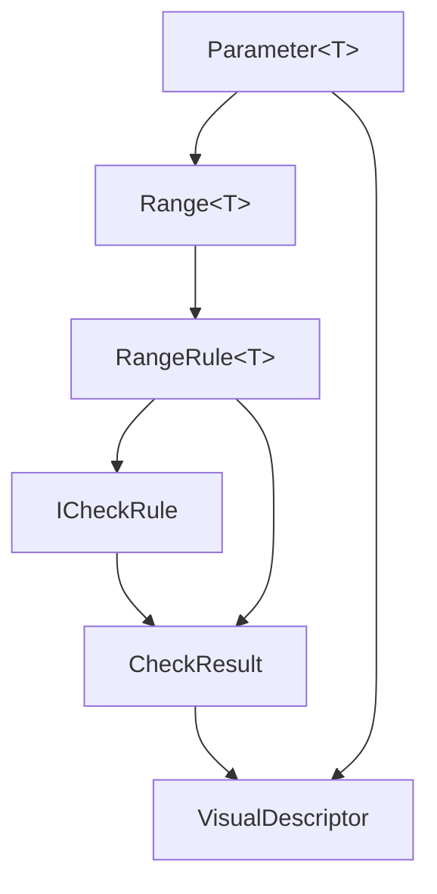
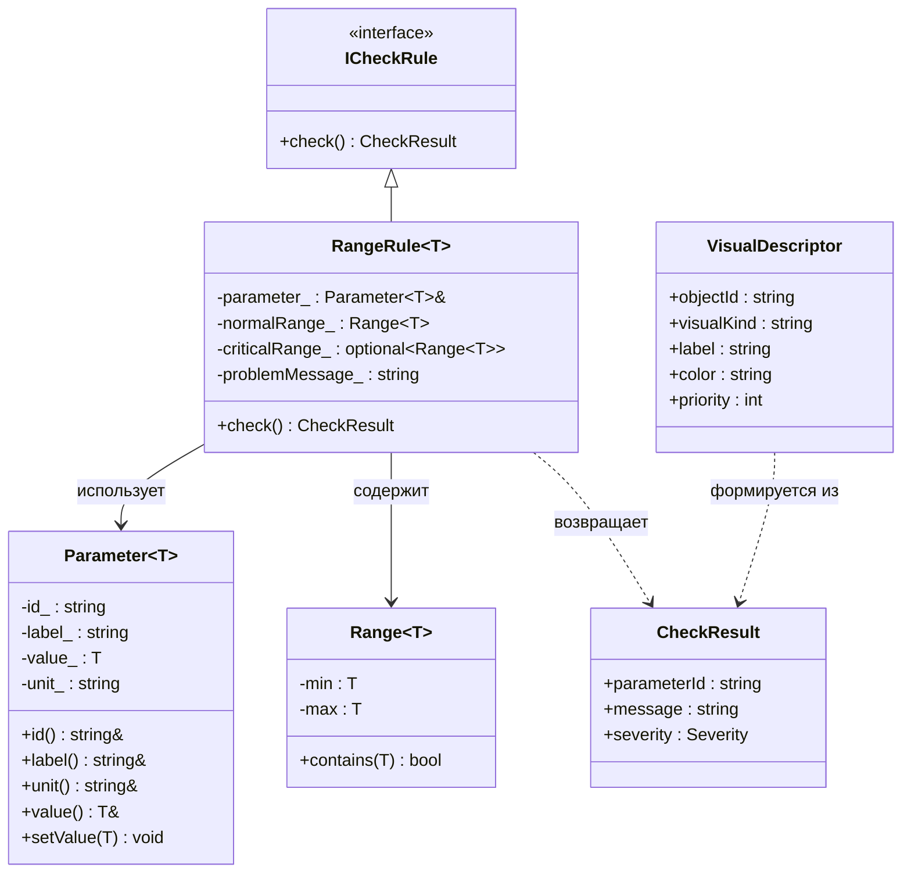

# dispatcher_trainer_lab1
Лабораторная работа 1: настройка рабочей конфигурации C++17/20.
## Среда
Основной вариант: VS Code + Docker Dev Container.
Альтернативный вариант: Linux в VirtualBox.
## Как открыть проект
1. Установить VS Code, Docker и расширение Dev Containers.
2. Открыть каталог проекта в VS Code.
3. Выполнить команду: Dev Containers: Reopen in Container.
## Сборка вручную
```bash
cmake -S . -B build/debug -G Ninja -DCMAKE_BUILD_TYPE=Debug
cmake --build build/debug
./build/debug/dispatcher_trainer_lab1
```
## Сборка в VS Code
1. CMake: Configure
2. CMake: Build
3. CMake: Run Without Debugging
4. Run and Debug → Debug CMake target with CodeLLDB
## Проверено
- [ ] контейнер открывается;
- [ ] CMake configure проходит без ошибок;
- [ ] проект собирается;
- [ ] программа запускается;
- [ ] breakpoint срабатывает;
- [ ] сделан первый commit.
# dispatcher_trainer — Лабораторная работа 2

Консольный прототип диспетчерского тренажёра транспортного узла.

## Вариант

**B — Диспетчер транспортного узла.**

Параметры состояния:
- Загруженность маршрута, %
- Связь с объектом (да/нет)
- Число активных нарушений

## Сборка и запуск

```bash
cmake -S . -B build -DCMAKE_BUILD_TYPE=Debug
cmake --build build
./build/dispatcher_trainer
## Будущая визуализация клиента
Вариант: диспетчер энергосети.
Планируемые элементы визуального ряда:
1. Карта объектов с маркерами подстанций.
2. Цветовой статус объекта: зелёный / жёлтый / красный.
3. Панель текущих параметров: нагрузка, связь, тревоги.4. AR-метка критического объекта над 3D-моделью.
5. AR-подсказка рекомендуемой команды диспетчера.
# Лабораторная работа 6 — Шаблоны и обобщённое программирование

## Вариант предметной области

**Транспортный диспетчер** — управление движением поездов на транспортном узле.

Параметры:
- Скорость поезда (`double`, км/ч)
- Интервал между поездами (`double`, мин)
- Задержка (`int`, мин)
- Занятость пути (`int`, %)
- Состояние светофора (`SignalState`, перечисление)

Визуальные слои: `platform_map`, `passenger_flow`, `gates`, `delays`, `ar_gate_marker`.

## Структура проекта

```
dispatcher-trainer/
├── CMakeLists.txt
├── README.md
├── .vscode/
│   ├── launch.json
│   └── settings.json
├── include/dispatcher/
│   ├── core/
│   │   ├── check_result.hpp        — Severity, CheckResult
│   │   ├── range.hpp               — concept OrderedValue, Range<T>
│   │   ├── parameter.hpp           — Parameter<T>
│   │   ├── rules.hpp               — ICheckRule, RangeRule<T>
│   │   ├── signal_state.hpp        — enum class SignalState
│   │   └── is_inside_range.hpp     — функциональный шаблон isInsideRange<T>
│   └── presentation/
│       └── visual_descriptor.hpp   — VisualDescriptor, makeDescriptor<T>, concept Streamable
├── src/main.cpp
└── tests/test_template_rules.cpp
```

## Команды сборки и запуска

```bash
# Создать ветку
git checkout -b lab6-templates

# Сборка
cmake -S . -B build -DCMAKE_BUILD_TYPE=Debug
cmake --build build

# Запуск приложения
./build/dispatcher_trainer

# Запуск тестов
ctest --test-dir build --output-on-failure
```

## Пример вывода

```
=== Проверка isInsideRange (функциональный шаблон) ===
isInsideRange(65.0, 0.0, 80.0) = 1
isInsideRange(3.5, 2.0, 10.0) = 1
isInsideRange(7, 0, 5) = 0

=== Проверка параметров через RangeRule<T> ===
V-101: OK [0]
I-201: OK [0]
D-301: Задержка недопустима [1]
O-401: OK [0]

=== Визуальные дескрипторы (DTO) ===
V-101 | gauge | Скорость поезда: 65 km/h | green | prio=0
I-201 | gauge | Интервал: 3.5 min | green | prio=0
D-301 | badge | Задержка: 7 min | yellow | prio=1
O-401 | badge | Занятость пути: 45 % | green | prio=0

=== Визуальные слои ===
- platform_map
- passenger_flow
- gates
- delays
- ar_gate_marker

=== Состояние светофора (enum class SignalState) ===
S-501 (Светофор): ON

Готово.
```

Тесты:
```
All tests passed!
```
## Mermaid-схема 1: поток данных



## Mermaid-схема 2: классы


```mermaid
classDiagram
    class Parameter~T~ {
        +string id_
        +string label_
        +T value_
        +string unit_
    }
    
    class Range~T~ {
        +T min_
        +T max_
        +bool contains(T value)
    }
    
    abstract class ICheckRule {
        +CheckResult check()
    }
    
    class RangeRule~T~ {
        -Parameter~T~ parameter_
        -Range~T~ normalRange_
        -optional~Range~T~~ criticalRange_
        -string problemMessage_
        +CheckResult check()
    }

    Parameter~T~ "1" *-- "1" RangeRule~T~ : содержит
    Range~T~ "1" *-- "1" RangeRule~T~ : использует
    ICheckRule <|-- RangeRule~T~ : наследуется
    ## Диаграмма классов (Lab 6)

```mermaid
classDiagram
    class Parameter~T~ {
        -string id_
        -string label_
        -T value_
        -string unit_
        +id() string
        +label() string
        +value() T
        +setValue(T) void
    }

    class Range~T~ {
        -T min
        -T max
        +contains(T) bool
    }

    abstract class ICheckRule {
        +check() CheckResult*
    }

    class RangeRule~T~ {
        -Parameter~T~ parameter_
        -Range~T~ normalRange_
        -optional~Range~T~~ criticalRange_
        -string problemMessage_
        +check() CheckResult
    }

    class CheckResult {
        +string parameterId
        +string message
        +Severity severity
    }

    class SignalState {
        <<enumeration>>
        Red
        Yellow
        Green
        Off
    }

    Parameter~T~ "1" *-- "1" RangeRule~T~ : parameter_
    Range~T~ "1..2" *-- "1" RangeRule~T~ : normalRange_ + criticalRange_
    ICheckRule <|-- RangeRule~T~ : наследование
    RangeRule~T~ ..> CheckResult : возвращает
    Parameter~SignalState~ ..> SignalState : инстанцируется
    # Диспетчерский тренажёр — Лабораторная работа 7

## Вариант предметной области
**Е — Диспетчерский тренажёр.** Параметры: скорость поезда, интервал между поездами, занятость пути, канал связи. События: команда, потеря связи, сервисное сообщение, предупреждение, авария.

## Использованные контейнеры STL
- `std::vector<ParameterRecord>` — список параметров (`ParameterList`)
- `std::vector<EventRecord>` — журнал событий (`EventLog`)
- `std::map<std::string, std::size_t>` — статистика по типам событий

## Реализованные алгоритмы STL
| Алгоритм | Где применяется |
|---|---|
| `std::find_if` | Поиск параметра по имени (`findParameterByName`) |
| `std::count_if` | Подсчёт тревожных событий (`countAlarmEvents`) |
| `std::copy_if` | Фильтрация тревожных событий (`getAlarmEvents`) |
| `std::sort` | Сортировка копии журнала по приоритету и ID (`getSortedEventLog`) |
| `std::transform` | Преобразование параметров в список имён и краткие строки (`getParameterNames`, `getParameterSummary`) |

Использовано 6 lambda-выражений в качестве предикатов и преобразований.

## Команды консольного меню
| Команда | Описание |
|---|---|
| `help` | Справка по командам |
| `status` | Текущие параметры узла |
| `set <param> <val>` | Изменить параметр (с автоматической проверкой диапазона) |
| `event <sev> <msg>` | Добавить событие вручную |
| `log` | Показать журнал событий |
| `find <name>` | Найти параметр по имени (find_if) |
| `alarm` | Показать тревожные события и их количество (count_if + copy_if) |
| `sorted` | Отсортированная копия журнала по приоритету (sort) |
| `stats` | Статистика по типам событий (map) |
| `summary` | Краткий список параметров вида name=value (transform) |
| `visual` | Список визуальных/AR-слоёв |
| `exit` | Завершить работу |

## Сборка в Docker devcontainer
```bash
cmake -S . -B build -DCMAKE_BUILD_TYPE=Debug
cmake --build build
./build/dispatcher_trainer

## Результаты тестирования ЛР 8 (modern C++)

### Проверка std::optional (поиск параметра)

    find V-101
    Найден: V-101 = 60 км/ч [0..80]

    find NOPE
    Параметр "NOPE" не найден.

text

✅ В коде нет возврата `-1` или пустых строк. Используется `std::nullopt`.

### Проверка std::variant (результат команды set)

    set V-101 70.0
    Команда принята: V-101 = 70

    set V-101 90.0
    Внимание: значение V-101 вне диапазона [0.000000..80.000000]

    set NOPE 1.0
    Параметр не найден: NOPE

text

✅ Результат команды имеет один из трёх типов: `CommandOk`, `CommandWarning`, `CommandError`. Преобразование в текст через `std::visit`.

### Проверка std::filesystem (сохранение журнала)

    save
    Журнал сохранён: logs/dispatch_session.txt

text

Проверка файла:
```bash
cat logs/dispatch_session.txt
[0] Info | system | Тренажёр запущен
[1] OperatorAction | V-101 | Оператор изменил скорость
...
[8] Warning | V-101 | Значение у границы диапазона
## Лабораторная работа 8: modern C++ — optional, variant, filesystem

Реализована проверка граничных значений параметров диспетчерского тренажёра с использованием `std::variant` для результатов команд.

### Проверяемые сценарии

| Сценарий | Значение | Ожидаемый результат | Порог (логика) |
|----------|----------|---------------------|----------------|
| Норма | 60.0 | Команда принята | В пределах [0..80] |
| Критическая зона (2%) | 79.0 | Критическая близость границы | 80 − (80 × 0.02) = 78.4 |
| Зона предупреждения (5%) | 77.0 | Предупреждение | 80 − (80 × 0.05) = 76.0 |
| Вне диапазона | 100.0 | Ошибка: значение вне диапазона | > 80 |

### Ключевые технологии
- `std::optional` — для поиска индекса параметра (`findParameterIndex`).
- `std::variant` — для разных типов результатов команд (успех, предупреждение, критическая ошибка).
- `std::filesystem` — сохранение журнала событий в файл.
- Mermaid-диаграммы классов (см. ниже).

### Диаграмма классов (пример для Parameter и правил проверки)

```mermaid
classDiagram
    class Parameter {
        +name: string
        +value: double
        +minValue: double
        +maxValue: double
        +unit: string
    }
    class RangeRule~T~ {
        -range: Range~T~
        -criticalPercent: double
        -warningPercent: double
        +check(value: T): CommandResult
    }
    class ICheckRule {
        <<interface>>
        +check(value: auto): CommandResult
    }
    Parameter *-- RangeRule : проверяется через
    RangeRule ..> ICheckRule : реализует